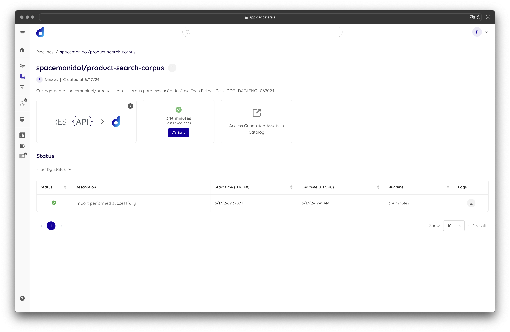

### case tech Felipe_Reis_DDF_DATAENG_062024

# Item 1 - Sobre Storytelling e Apresentação

## Apresentação da solução

### Principal problema a ser resolvido

Na arquitetura atual o cliente faz a leitura, tratamento e armazenamento dos dados gerados na sua operação.
Para alcançar o objetivo de fornecer modelos de IA para melhorar a experiência de compra dos clientes, é necessário uma complementação desta arquitetura no sentido de
viabilizar a parte analítica do processo que vai ser essencial para o treinamento dos modelos de IA.

### Diagrama da solução com Dadosfera

Apresentamos a solução DADOSFERA com 2 cenários: 
- no primeiro cenário sugerimos a migração completa da coleta para a Dadosfera junto com a ampliação da arquitetura para atender analytics
e data apps dentro da DADOSFERA consolidado todas as etapas do processo.
- o segundo cenário considera a ampliação para analytics e data apps no ambiente dadosfera e a integração com a coleta e data lake já existentes.

[Link para o diagrama](https://app.eraser.io/workspace/jv24ayPmOmPFkkuhCnfD?origin=share)

### Oportunidades e ganhos futuros de se adotar a DADOSFERA, frente a solução atual

A solução DADOSFERA permite de fato extrair valor dos dados gerados e alcançar o objetivo de fornecer modelos de IA para as tomadas de decisão que vão melhorar a experiência dos clientes.
Existem duas principais vantagens em se adotar a DADOSFERA:

 - Single strike point - processo global de montagem dos modelos em um único ambiente integrado que pode ser operado por não especialistas.
 - One ticket, all rides - substituição do custo da arquitetura atual para a DADOSFERA com entrega da solução completa.

[Link para vídeo de apresentação](https://youtu.be/rwYZaHpzD_o)

# Item 2 - Sobre a Dadosfera

## Carregamento

Nome: spacemanidol/product-search-corpus
Descrição: Carregamento spacemanidol/product-search-corpus para execução do Case Tech Felipe_Reis_DDF_DATAENG_062024

[Lint REST API dataset source](https://huggingface.co/api/datasets/spacemanidol/product-search-corpus)

[Link alternativo](https://huggingface.co/api/datasets/trec-product-search/product-search-corpus)

## Análise descritiva

## Catálogo

# Item 3 - Sobre GenAI e LLMs

# Item 4 - Sobre SQL e Python

# Item 5 - Sobre Data Apps

