# Case Tech Felipe_Reis_DDF_DATAENG_062024

## Item 1 - Sobre Storytelling e Apresentação

### Apresentação da solução

### Principal problema a ser resolvido

Na arquitetura atual o cliente faz a leitura, tratamento e armazenamento dos dados gerados na sua operação.
Para alcançar o objetivo de fornecer modelos de IA para melhorar a experiência de compra dos clientes, é necessário uma complementação desta arquitetura no sentido de
viabilizar a parte analítica do processo que vai ser essencial para o treinamento dos modelos de IA.

### Diagrama da solução com Dadosfera

Apresentamos a solução DADOSFERA com 2 cenários: 
- no primeiro cenário sugerimos a migração completa da coleta para a Dadosfera junto com a ampliação da arquitetura para atender analytics
e data apps dentro da DADOSFERA consolidado todas as etapas do processo.
- o segundo cenário considera a ampliação para analytics e data apps no ambiente dadosfera e a integração com a coleta e data lake já existentes.

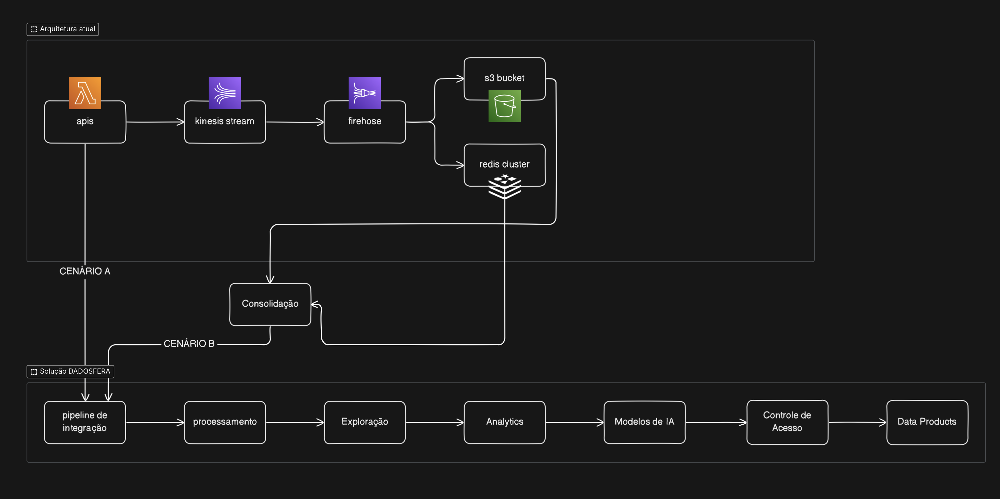

[Link para o diagrama](https://app.eraser.io/workspace/jv24ayPmOmPFkkuhCnfD?origin=share)

### Oportunidades e ganhos futuros de se adotar a DADOSFERA, frente a solução atual

A solução DADOSFERA permite de fato extrair valor dos dados gerados e alcançar o objetivo de fornecer modelos de IA para as tomadas de decisão que vão melhorar a experiência dos clientes.
Existem duas principais vantagens em se adotar a DADOSFERA:

 - Single strike point - processo global de montagem dos modelos em um único ambiente integrado que pode ser operado por não especialistas.
 - One ticket, all rides - substituição do custo da arquitetura atual para a DADOSFERA com entrega da solução completa.

[Link para vídeo de apresentação](https://youtu.be/6gPQH5IskJA)

## Item 2 - Sobre a Dadosfera

### Carregamento

Pipeline de importação do dataset
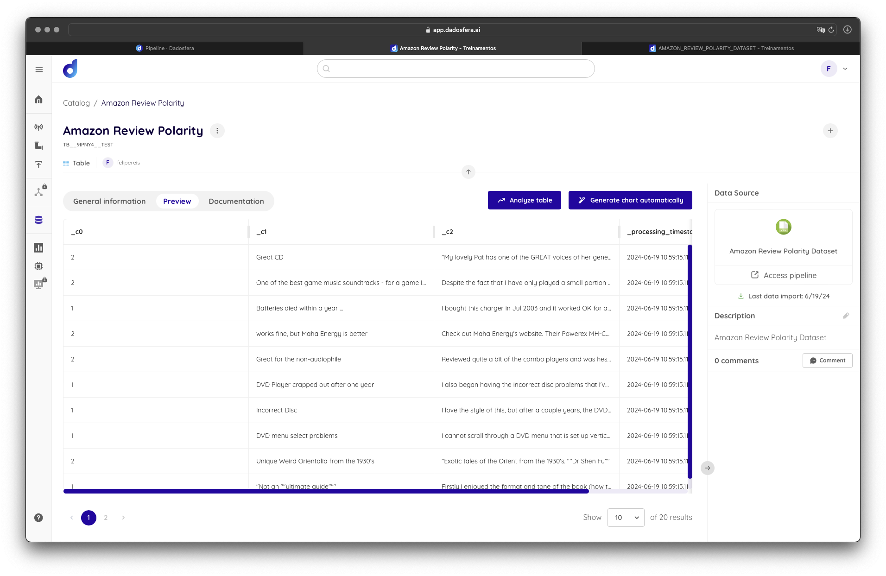

### Análise descritiva

Na busca por possíveis anomalias, foram encontradas instancias que tinham a feature principal do dataset, review, nula. Para mitigar os efeitos indesejados, estas instâncias foram filtradas do dataset utilizando um pipeline jupyter no modulo Integliência.

## Item 3 - Sobre GenAI e LLMs

Dentro do projecto FELIPE_REIS_DDF_ENG_DADOS_062024 foi criado um pipeline para recuperação dos dados, tratamento e classificação.

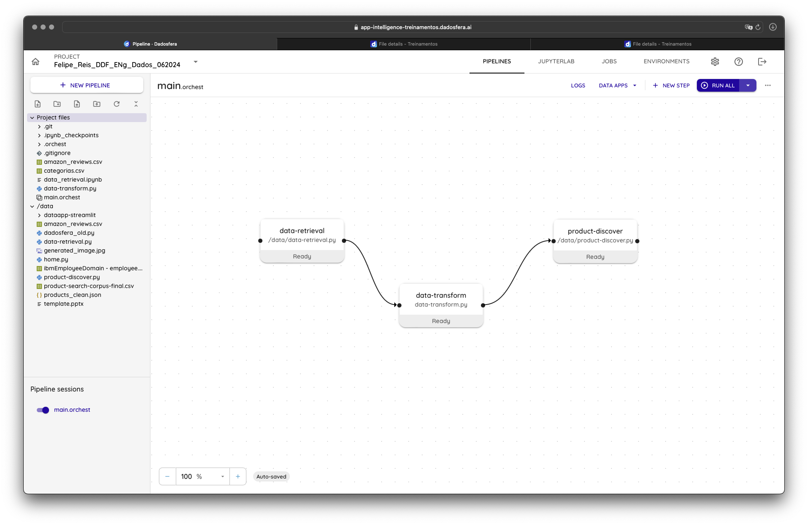

Neste pipeline a idéia foi enriquecer o dataset com uma nova feature por meio de LLM.

A princípio o dataset contém as features:
 - Polaridade : binária indicando se o cliente deu uma review positiva ou negativa
 - Título : campo texto com o heading da review
 - Review : campo texto com a review

Nesse cenário seria interessante entender sobre qual produto ou categoria de produto a revisão está relacionada. Assim seria possível entender qual tipo de produto está sendo melhor aceito pelos clientes e, a partir desta informação, tomar medidas para melhorar as vendas dos produtos que estão sendo desqualificados.

Pensando dessa forma, foi utilizado LLM por meio da importação da biblioteca da openai para criar a feature "Categoria" dentro do dataset. 

Exemplo da feature Category dentro do dataset
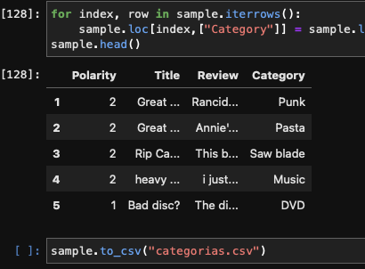

## Item 4 - Sobre SQL e Python

### Geração de Valor

Com a etapa de LLM enriquecendo o dataset com a categoria dos produtos das reviews podemos gerar insights de valor. Para tal vamos realizar perguntas/consultas no dataset

1. Quais são as 5 categorias com maior frequência de reviews negativas?

`
select top 5 category, count(*) as frequency from TB__SGI1RN__DATASET_AMAZON_REVIEW_CATEGORY where polarity = 2 group by category order by count(*) desc
`
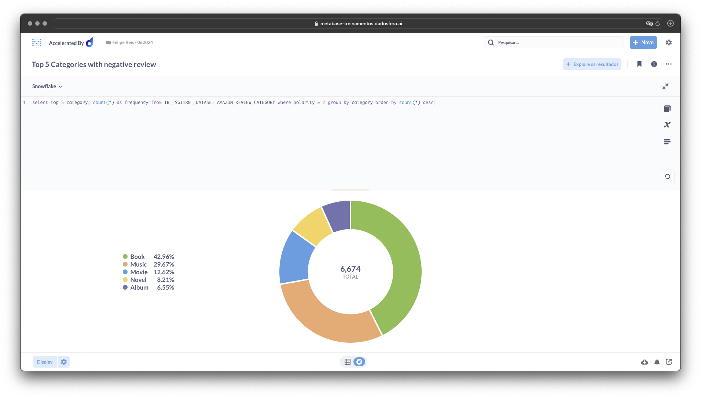

2. De forma analoga, tabmém é interessante saber quais são os produtos com mais reviews positivas

`
select top 5 category, count(*) as frequency from TB__SGI1RN__DATASET_AMAZON_REVIEW_CATEGORY where polarity = 1 group by category order by count(*) desc
`

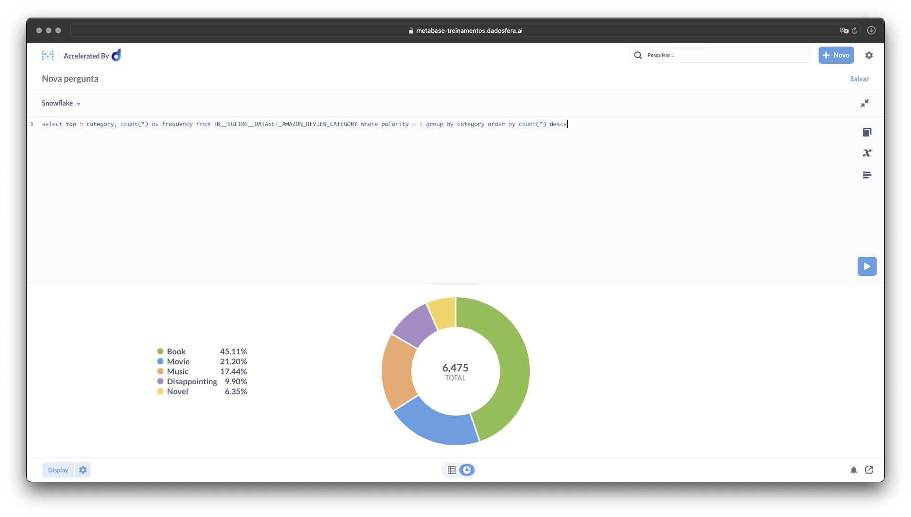

3. Outro conhecimento importante para entender a amplitude de reviews por categoria é a diferença entre a quantidade de reviews entre a categoria que tem mais e a categoria que tem menos reviews. Isto podemos observar no gráfico de barras gerado com a seguinte consulta sql:

`
select top 50 category, count(*) as frequency from TB__SGI1RN__DATASET_AMAZON_REVIEW_CATEGORY group by category order by count(*) desc
`

resultando no gráfico:

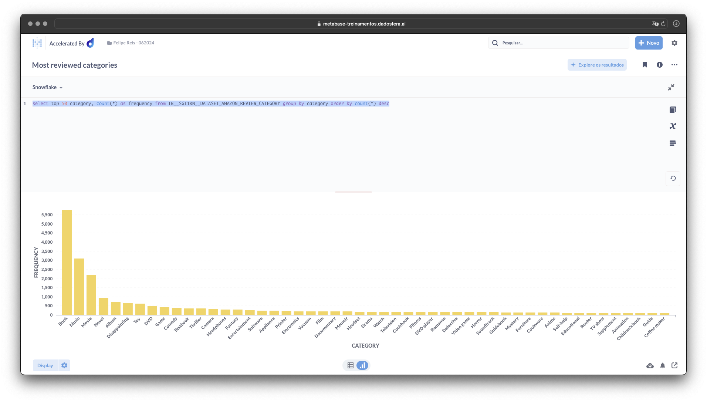

Apresentando o dashboard com as consultadas realizadas.

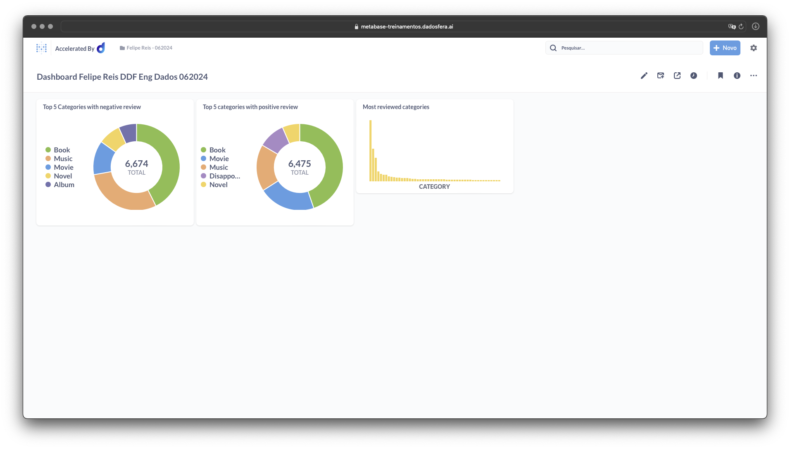

## Item 5 - Sobre Data Apps

Uma análise interessante para o time de negócio, seria uma recomendação de quais categorias de produtos poderiam passar por uma substituição de SKUs, a fim de aumentar as chances de seus clientes encontrarem produtos que vão gostar de ter comprado.

Um DataApp é ideal para essa situação já que o time de compras não tem especialistas em dados.

[Link para o DataApp](https://app-intelligence-treinamentos.dadosfera.ai/pbp-service-dataappmetareviews-4a97db95-bc94-4d98c3fd6816-16f8-4648_8501/)

## Assets do Case Tech

Print do projeto no módulo inteligência.

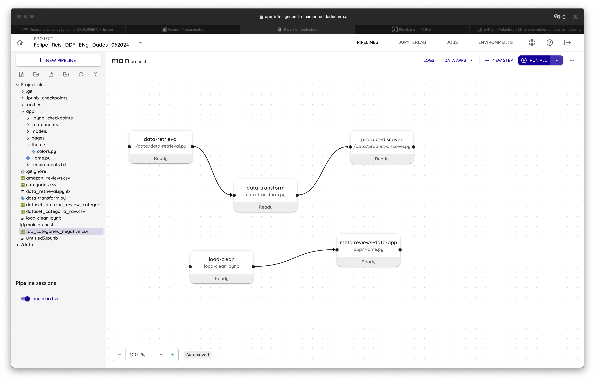

Print DataApp no módulo Catalog

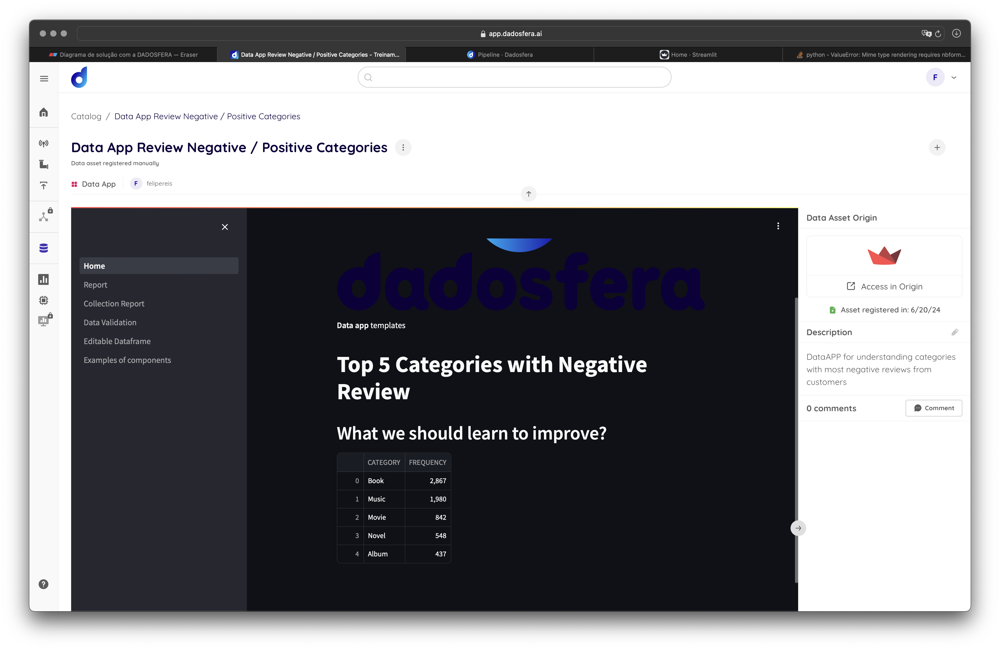

Print do Dashboard criado no módulo Visualização

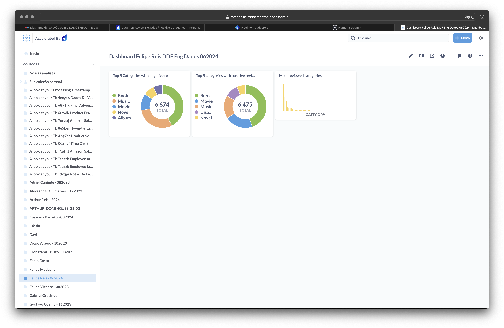

Print do Dashboard criado no módulo Visualização

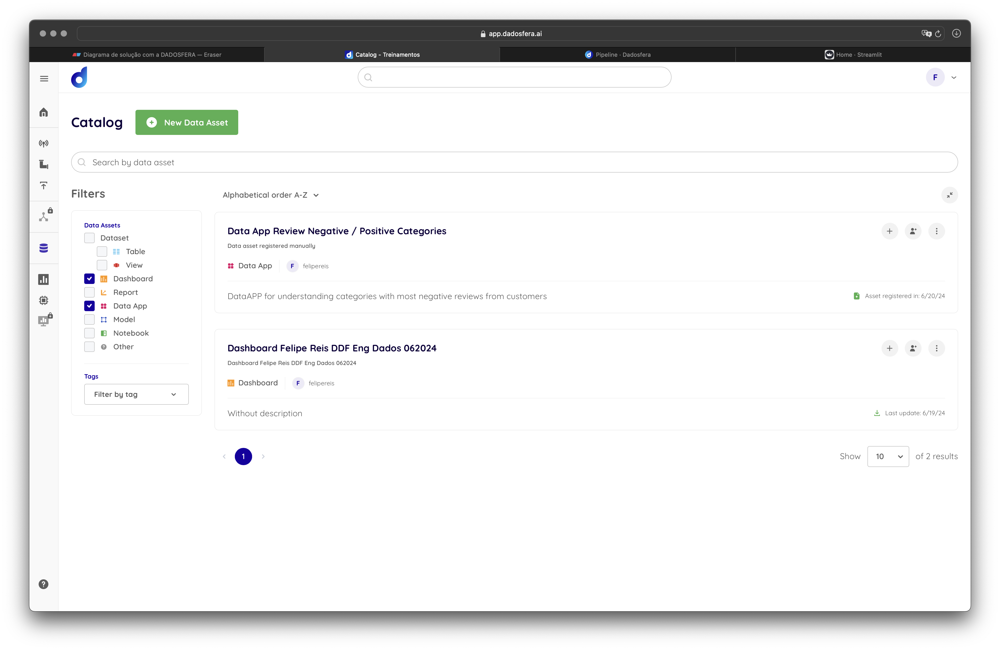

## Conclusão

Muito interessante conhecer a plataforma dadosfera e perceber que o produto é realmente um presente para a indústria.

Dentro do teste acho que poderia ter melhorado a maneira como eu importei os dados entre os módulos. Acredito que tenha uma forma melhor e que eu não conheci ainda pela documentação.

Com mais tempo faria com certeza o Item Bonus.

Teria ficado mais feliz com o resultado se tivesse escolhido um dataset mais elaborado para trazer insights mais interessantes. Fiz o trade off pela praticidade e economia de tempo, perdendo um pouco na qualidade do resultado.

Agradeço a oportunidade. Obrigado pela atenção e até breve.w